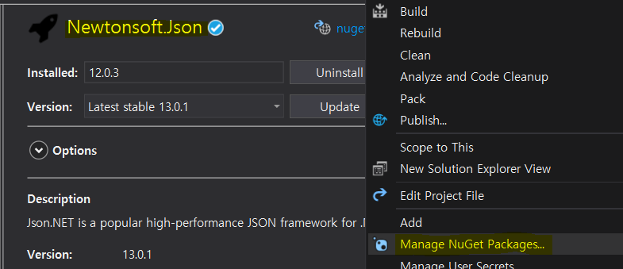

이 글에서는 [Google Device OAuth API](https://developers.google.com/identity/protocols/oauth2/limited-input-device)를 통해 `GoogleOAuthService`라는 서비스를 만들어본다.  
기기 인증 방식은 TV 같이 입력이 제한된 환경에서 사용하는 프로그램을 개발할 때 사용된다.  
Device OAuth 외에 다른 인증 방법들은 웹브라우저를 통해 인증이 진행되기 때문에  
리눅스 CLI 환경의 프로그램을 개발하던 나는 기기 인증 방식을 선택했다.  

<br/>

Google OAuth API를 사용하려면 사용자 인증 정보가 필요한데  
이글에서는 사용자 인증 정보를 얻는것에 대해 설명하지 않는다.  
사용자 인증 정보를 얻는 방법에 대해선 [Google 사용자 인증 정보 만들기](../ETC/2021-05-08-Google-API-Credentials.md)문서를 보면된다.

<br/>

## 1. 준비하기

API를 호출할 때 HTTP 요청을 보내야하기때문에 `HttpRequestService` 를 만들어준다.

```cs
public static class HttpRequestService
{
    public static string HttpRequest(string url, string data, WebHeaderCollection headers = null, string contextType = "application/x-www-form-urlencoded")
    {
        HttpWebRequest request = (HttpWebRequest)WebRequest.Create(url);
        request.Method = WebRequestMethods.Http.Get;
        request.ContentType = contextType;

        if (headers != null) request.Headers = headers;

        if (!string.IsNullOrEmpty(data))
        {
            request.Method = WebRequestMethods.Http.Post;

            byte[] bytes = Encoding.UTF8.GetBytes(data);
            request.ContentLength = bytes.Length;

            using (Stream reqStream = request.GetRequestStream())
            {
                reqStream.Write(bytes, 0, bytes.Length);
            }
        }

        string responseText = string.Empty;

        try
        {
            using (HttpWebResponse resp = (HttpWebResponse)request.GetResponse())
            {
                Stream respStream = resp.GetResponseStream();
                using (StreamReader sr = new StreamReader(respStream))
                {
                    responseText = sr.ReadToEnd();
                }
            }
        }
        catch (WebException ex)
        {
            using (var stream = ex.Response.GetResponseStream())
            using (var reader = new StreamReader(stream))
            {
                responseText = reader.ReadToEnd();
            }
        }
        catch (Exception ex)
        {
            responseText = ex.Message;
        }

        return responseText;
    }
}
```

<br/>

API의 요청에 대한 응답값은 Json 형태로 보내진다.  
우리는 Json값을 처리하기위해 NuGet에서 `Newtonsoft.Json`를 사용한다.


<br/>

이제 GoogleOAuthService를 만들기 위한 기본적인 준비는 끝났다.

<br/>

## 2. Google Device OAuth2.0 Service 전체 소스코드
아래의 내용은 Google Device OAuth 문서를 따라 C#으로 구현한것이다.

<br/>

```cs
public class GoogleOAuthService
{
    private class AuthResponse
    {
        public string Device_Code { get; set; }
        public string User_Code { get; set; }
        public string Verification_Url { get; set; }
        public int Expires_In { get; set; }
        public int Interval { get; set; }
    }

    public class Token
    {
        public string Access_Token { get; set; }
        public string Refresh_Token { get; set; }
        public string Token_Type { get; set; }
        public string Scope { get; set; }
        public int Expires_In { get; set; }
    }


    const string OauthBase = "https://oauth2.googleapis.com";

    private readonly string _clientId;
    private readonly string _clientSecret;

    public Token CurrentToken { get; set; }


    public GoogleOAuthService(string clientId, string clientSecret)
    {
        _clientId = clientId;
        _clientSecret = clientSecret;
    }

    public void DeviceOAuth()
    {
        // RefreshToken 이 존재하면 기기인증을 하지않고 새 토큰을 받아온다.
        if (File.Exists($"{Directory.GetCurrentDirectory()}\\RefreshToken"))
        {
            RefreshToken();

            return;
        }

        // RefreshToken 이 저장되어 있지 않을 때.
        string data = $"client_id={_clientId}&scope=https://www.googleapis.com/auth/youtube";

        var authResp = JsonConvert.DeserializeObject<AuthResponse>(HttpRequestService.HttpRequest($"{OauthBase}/device/code", data));

        Console.WriteLine($"Verification Url : {authResp.Verification_Url}\nUser Code : {authResp.User_Code}");

        CurrentToken = AuthPolling(authResp);

        File.WriteAllText($"{Directory.GetCurrentDirectory()}\\RefreshToken", CurrentToken.Refresh_Token);
    }

    public void RefreshToken()
    {
        string data = $"client_id={_clientId}&client_secret={_clientSecret}&refresh_token={File.ReadAllText($"{Directory.GetCurrentDirectory()}\\RefreshToken")}&grant_type=refresh_token";

        var pollingResp = HttpRequestService.HttpRequest($"{OauthBase}/token", data);

        if (pollingResp.Contains("error")) return;

        CurrentToken = JsonConvert.DeserializeObject<Token>(pollingResp);
    }

    private Token AuthPolling(AuthResponse authResp)
    {
        while (true)
        {
            var tokenResp = RequestPolling(authResp);

            if (tokenResp != null) return tokenResp;

            Thread.Sleep(authResp.Interval * 1000);
        }
    }

    private Token RequestPolling(AuthResponse authResp)
    {
        string data = $"client_id={_clientId}&client_secret={_clientSecret}&device_code={authResp.Device_Code}&grant_type=urn:ietf:params:oauth:grant-type:device_code";

        var pollingResp = HttpRequestService.HttpRequest($"{OauthBase}/token", data);

        if (pollingResp.Contains("error")) return null;

        return JsonConvert.DeserializeObject<Token>(pollingResp);
    }
}
```