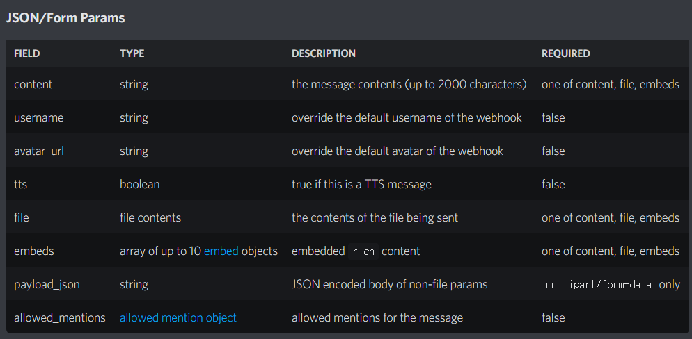

이 글에서는 디스코드 웹훅을 통해 서버의 채널에 메시지를 전송해본다.  
웹훅에 관한 레퍼런스는 [Discord Developer Portal](https://discord.com/developers/docs/resources/webhook#execute-webhook)을 참고하면된다.  

<br/>

## 웹훅 생성하기

웹훅을 통해 메시지를 전송할 채널의 설정에서  
`연동 > 웹후크`를 들어간뒤 웹훅을 생성해 준다.


웹훅이 생성되었다면 웹훅의 URL을 복사해둔다.  

<br/>

## 메시지 전송하기
웹훅의 URL로 메시지를 보내기위해선 HTTP요청을 보내기위한 서비스가 있어야한다.  
이 글에서는 예전에 만들어두었던 [HttpRequestService](https://gist.github.com/MaJaeGeon/e6818f58a16a036f46f70e39b883fdb8)를 사용한다.  

아래의 표를 참고하여 웹훅의 파라미터를 설정한뒤 요청을 보내주면된다.  


<br/>

### 일반 텍스트 전송하기
```cs
static void Main(string[] args)
{
    string webhookUrl = "Webhook URL";
    string data = "{\"content\": \"Webhook Test Message\"}";

    HttpRequestService.HttpRequest(webhookUrl, data, "application/json");
}
```