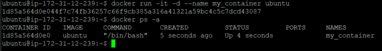

이 글에서는 [Docker Commands](./2021-06-05-Docker-Commands.md/#Docker-Container-Commands)에서 자주 사용되는  
**Container** 명령어의 사용법을 설명한다.

<br/>

## 컨테이너 생성하기
`create` 명령어로 컨테이너를 생성할 수 있다.
명령어의 인자에는 컨테이너의 베이스가 될 이미지를 지정한다.  
이미지의 태그를 생략하면 자동으로 `latest`태그가 붙게된다.

```shell
$ docker create <Image Name>:<Tag>
# docker create ubuntu              : latest 태그가 붙게된다.
# docker create ubuntu:18.04        : 18.04 라는 태그가 붙었다.
```
컨테이너는 생성될 때 자동으로 이름이 지정되는데, `--name`옵션을  
지정하면 생성하는 컨테이너에 이름을 지정할 수 있다.
```shell
$ docker create --name <Container Name> <Image Name>:<Tag>
# docker create --name my_first_container ubuntu
# my_first_container 라는 이름의 ubuntu 컨테이너를 생성한다. 
```


<br/>

## 컨테이너 목록보기
`ps` 명령어로 생성되어있는 컨테이너의 목록을 볼수 있다.  
옵션을 지정하지않으면 현재 가동중인 컨테이너의 정보만 출력된다. 
```shell
$ docker ps
```

`-a` 옵션을 지정하면 종료된 컨테이너들의 정보까지 출력된다. 
```shell
$ docker ps -a
```


`-q` 옵션을 지정하면 컨테이너들의 아이디만 출력된다.
이 옵션은 다른 명령어들과 함께 사용된다. 
```shell
$ docker ps -q      # 가동중인 컨테이너의 아이디만 보기
$ docker ps -a -q   # 종료된 컨테이너의 아이디도 함께 보기
```


`ps` 명령어로 컨테이너의 목록을 출력하면  
여러 항목들이 나타내는데 각 항목들의 의미는 아래의 표와 같다.
| Column | Description |
| :-: | :- |
| CONTAINER ID | 컨테이너의 아이디 (보여지는 아이디는 전체아이디가 아닌 아이디의 일부분이다.) |
| IMAGE | 해당 컨테이너에 베이스로 지정된 이미지 |
| COMMAND | 컨테이너 실행시 지정되는 프로세스의 이름 |
| CREATED | 컨테이너 생성 후 경과 시간 |
| STATUS | 현재 컨테이너의 상태  (Created: 생성후 실행되지않음, Up: 실행중, Pause: 중지, Existed: 종료)|
| PORTS | 호스트 특정 포트와 연결된 컨테이너의 포트 관계 |
| NAMES | 컨테이너의 이름 |


<br/>

## 컨테이너 삭제하기
`rm` 명령어로 컨테이너를 삭제할 수 있다.
명령어의 인자에는 삭제할 컨테이너의 아이디나 이름을 지정한다.  
```shell
$ docker rm <Container Id || Container Name>
```


`ps`명령어와 함께 사용하면 여러 컨테이너를 한번에 삭제할 수 있다.
```shell
$ docker rm $(docker ps -a -q)
```

<br/>

## 컨테이너 실행하기
`start` 명령어로 컨테이너를 실행할 수 있다.  
명령어의 인자에는 삭제할 컨테이너의 아이디나 이름을 지정한다. 
```shell
$ docker start <Container Id || Container Name>
```


생성직후 별도의 옵션이 지정되지않은 컨테이너는 바로 종료된다.  
[Dockerfile](./2021-06-06-Dockerfile.md)에서 더 자세히 설명하겠지만, 도커는 컨테이너를  
하나의 프로세스로 관리하기 때문에 컨테이너의 작업이 끝나면 종료된다.  
**my_first_container** 컨테이너는 **"bin/bash"** 를 실행하는데
**bash**는 리눅스의 기본 **shell** 프로그램으로 표준 입력을 받을 수 없는 상태가 되면 프로그램이 종료된다.  
따라서 키보드를 통해 표준 입력을 받지 못하는 컨테이너 에서는 **bash**가 바로 종료되기 때문에 컨테이너의 작업이 끝난다.  
이 내용은 운영체제에서 프로세스의 라이프 사이클에 대해 알아보면된다.  

<br/>

## 컨테이너 생성과 동시에 실행하기
`run`명령어로 한번에 컨테이너를 생성하고 실행할 수 있다.  
```shell
$ docker run <Image Name>:<Tag> <Command> <Options>
```


**Command** 인자에 대해서는 [Dockerfile](./2021-06-06-Dockerfile.md)에서 `CMD`를 참고하면된다.  

별도의 옵션이 지정되지 않으면 `start`명령어와 마찬가지로 
실행시 바로 종료된다.

**run 명령어에서 사용할 수 있는 옵션 목록**
|Option|Description|
| :-: | :- |
| -i | 컨테이너 입력을 열어놓는 옵션 |
| -t | 컨테이너에 가상 터미널을 할당하는 옵션 |
| --name | 컨테이너 이름을 지정하는 옵션 |
| -d | 컨테이너를 백그라운드로 실행하는 옵션 |
| --rm | 컨테이너 종료시 컨테이너를 자동 삭제하는 옵션 |
| -p | 호스트와 컨테이너의 포트를 연결하는 옵션 |
| -v | 호스트의 경로를 컨테이너의 디렉토리에 연결하는 옵션 |
| --link | 컨테이너와 컨테이너를 연결하는 옵션 |

컨테이너 실행시 컨테이너가 종료되지않게 하려면 `-i`와 `-t` 옵션을  
사용하여 표준입력을 할수 있도록 해주어야된다.  
`-i`는 컨테이너의 표준 입력을 열어놓는 옵션이고,  
`-t`는 키보드의 입력을 **pseudo tty**를 통해 컨테이너에 전달하는 옵션이다.  
이 두 옵션은 보통 함께 사용되며, `-it`처럼 붙여서 사용할 수도 있다.  

하지만 `-it` 옵션을 붙여 컨테이너를 생성 및 실행시키면  
터미널이 컨테이너에 들어가기 때문에 도커에 명령을 할 수 없다.  
그렇다고 컨테이너에 연결된 터미널을 종료하면 컨테이너는 종료된다. 


이를 해결하려면 `-d`옵션을 붙여 터미널을 백그라운드로 실행시키면된다.   
터미널은 도커에 명령을 내릴 수 있고, 컨테이너는 실행중이다.



`--rm`옵션을 붙이면 컨테이너 종료시 컨테이너가 삭제되도록 할수 있다.  
보통 테스트용 컨테이너에 사용된다. 


`-p`, `-v`, `--link`옵션은 이 글에서 설명하기는 무리가 있다.  
이 옵션들은 [도커 APM서버 만들기](./Docker-Create-APM-Server.md)를 참고하면된다.

<br/>

## 컨테이너 종료하기
`stop` 명령어로 컨테이너를 종료할 수 있다.  
이 명령어는 현재 진행중인 작업을 끝낸뒤 컨테이너를 종료한다.  
```shell
$ docker stop <Container Id || Container Name>
```


`kill`명령어를 사용하면 컨테이너를 강제로 종료시킬 수 있다.
```shell
$ docker kill <Container Id || Container Name>
```

컨테이너를 종료하는 명령어들 또한 명령어를 조합하여 사용할 수 있다.  
```shell
$ docker stop $(docker ps -q)       
$ docker kill $(docker ps -q)
```

<br/>

## 컨테이너에 명령어 사용하기
`exec`명령어로 실행중인 컨테이너 내에 명령을 내릴 수 있다.  
```shell
$ docker exec <Options> <Container Id || Container Name> <Command> <Args>
```

<br/>

## 컨테이너 접속하기
`attach`명령어로 백그라운드에서 실행중인 컨테이너에 접속할 수 있다.  
```shell
$ docker attach <Container Id || Container Name>
```


접속한 컨테이너에서 나가려면 `ctrl + D`를 누르거나  
`exit`를 입력하면되며, 이때 컨테이너는 종료되지 않는다.

## 컨테이너를 이미지로 변환하기
`commit`명령어를 사용하면 컨테이너를 이미지로 변환할 수 있다.  
```shell
$ docker commit <Options> <Container Id || Container Name> <Image Name>:<Tag>
```
컨테이너를 사용하다보면 베이스 이미지에서 추가되거나 삭제되는 등의  
변경사항이 있는데 이것들을 이미지변환하여 사용할 수 있다.  

아래의 사진을 보면 기본 ubuntu 이미지는 **nano**에디터가 설치되어있지 않다.  


따라서 **nano** 에디터를 설치해주면 **my_container** 컨테이너에는  
베이스 이미지에는 없는 **nano** 에디터가 설치되어있다.  


컨테이너에서 나온뒤 `commit` 명령어로 원하는 이미지의 이름으로 이미지를  
생성한뒤 생성한 이미지로 컨테이너를 생성하면 아래 사진처럼 **nano**에디터가  
설치된 이미지로 컨테이너를 실행할 수 있다.  


<br/>

## 컨테이너의 파일 가져오기
`cp` 명령어를 사용하면 컨테이너의 특정경로에 있는 파일을  
호스트 PC로 가져올 수 있고, 반대로 가져다 놓을 수도 있다.  
```shell
$ docker cp <Container Name>:<Container Path> <Host Path>   # 가져오기
$ docker cp <Host Path> <Container Name>:<Container Path>   # 가져다 놓기
```

아래 사진은 컨테이너의 파일을 호스트 PC로 가져온다.  


아래의 사진에서는 반대로 호스트 PC의 파일을 컨테이너 안으로 복사한다.  


이 명령어는 보통 컨테이너의 특정파일을 확인하는 용도로 사용된다.  