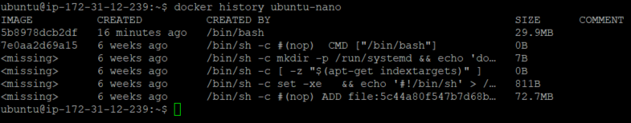
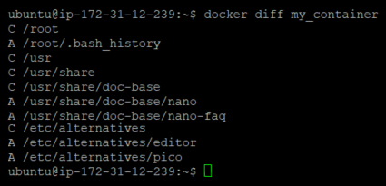
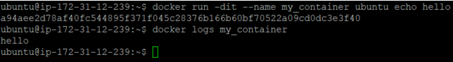
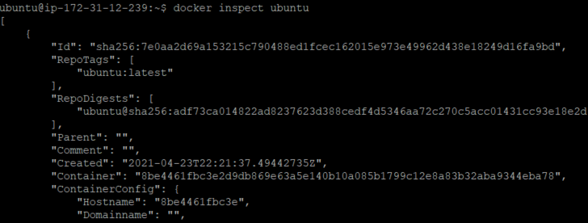

## 이미지 기록 보기
`history`명령어를 사용하면 특정 이미지의 기록을 볼 수 있다.  
```bash
$ docker history <Image Name>:<Tag>
```

아래 사진은 **ubuntu**이미지가 설치된 컨테이너에 **nano**에디터를 설치한 후  
이미지로 변환한 이미지의 기록이다.  


<br/>

## 컨테이너 변경사항 보기
`diff`명령어를 사용하면 컨테이너의 변경사항들을 볼 수 있다.
```bash
$ docker diff <Container Name>
```
파일 또는 디렉토리의 변경사항은 `A`는 추가, `C`는 수정, `D`는 삭제로 구분된다.

아래의 사진은 **ubuntu**이미지를 설치한 컨테이너에 **nano**에디터를 설치한 것이다.  


> **nano**를 설치한 **ubuntu**를 이미지화 한뒤 설치한 컨테이너가 아닌  
> 공식 **ubuntu** 이미지를 설치한 컨테이너에 **nano**를 설치한 것이다.

<br/>

## 컨테이너 로그 보기
`log`명령어를 사용하면 컨테이너의 표준 출력 결과를 확인할 수 있다.  
```bash
$ docker logs <Container Name>
```



## 이미지와 컨테이너 세부 정보 보기
`inspect`명령어를 사용하면 이미지나 컨테이너의 세부정보를 확인할 수 있다.  
```bash
$ docker inspect <Image Name || Container Name>
```

아래의 사진은 **ubuntu**이미지의 세부 정보로, `JSON`형식으로 출력된다.  



일부 세부정보에 대해서는 [Dockerfile](./2021-06-06-Dockerfile.md) 에서 설명한다.  