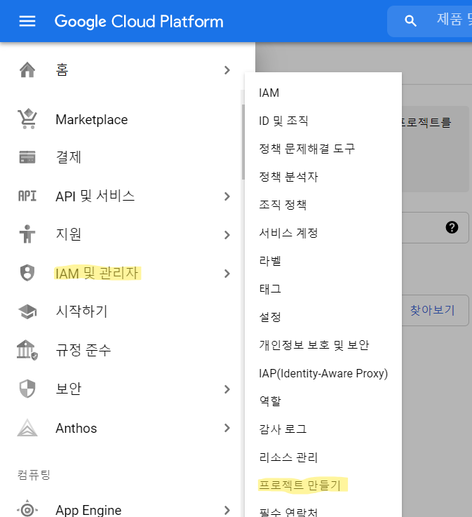

Google에서 제공하는 API를 사용하려면 `Client Id` 와 `Client Secret`이  
필요한데 이 두개는 사용자 인증 정보를 통해 발급 받을 수 있다.  
이 글에서는 Google 사용자 인증 정보를 만드는법에대해 알아본다.  

 

## 1. Google Cloud Platform 접속하기
[Google Cloud Platform](https://console.cloud.google.com)에 접속한다.

  

## 2. 프로젝트 만들기
  
사진에 표시된것처럼 `IAM 및 관리자 > 프로젝트 만들기`에 들어간다.  

 

  
프로젝트 명은 자신이 원하는 이름으로 하고 만들기 버튼을 누른다.  

 

  
프로젝트가 정상적으로 생성되었다면 위 사진처럼 생성된 프로젝트가 보일것이다.

 

## 3. OAuth 동의 화면 구성하기
  
OAuth 동의 화면에서 외부를 선택한뒤(내부를 선택해도 문제는 없다.) 만들기를 누르면  
앱에대한 정보를 입력하는 페이지가 나오는데 내 앱에대한 정보를 입력하고 다음을 눌러준다.  

 

  
테스트 사용자 페이지에서 `ADD USERS` 버튼을 누른뒤  
테스트에 사용할 계정을 등록하고 `저장후 게속` 버튼을 누른다.

 

## 4. 사용자 인증 정보 만들기
  
`사용자 인증 정보 > 사용자 인증 정보 만들기 > OAuth 클라이언트 ID` 눌러준다.  

 

  
애플리케이션 유형과 이름을 자신의 앱에서 사용할 정보에 맞게 선택한뒤 만들기를 누른다.  

 

이 과정을 통해 생성된 `Client Id`와 `Client Secret`을 통해 OAuth2.0 API에 접근할 수 있다.  
`Client Secret`은 외부에 공개되어서는 안된다.