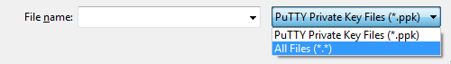

EC2 를 putty로 연결하려면 아래의 두 프로그램이 필요하며  
[여기](https://www.chiark.greenend.org.uk/~sgtatham/putty/latest.html)에서 다운로드 받을 수 있다.
- putty
- puttygen

## Private Key 변환하기

인스턴스를 생성할 때 다운받은 **Key Pairs 파일** `*.pem` 을  
**PuTTY private key** `*.ppk` 파일로 변환해야한다.

**puttygen.exe** 를 실행시키고 **key**의 **type**을 아래 사진과 같이 변경한다.  

이후 **Load** 버튼을 눌러 **Key Pairs 파일** `*.pem` 을 불러온다.  
파일이 안보일 경우 아래 사진과 같이 옵션을 **All Files**로 변경한다.

**Save private key** 버튼을 누르면되면 암호 없이 키 저장에 대한 경고가 표시되는데 무시하고 **예**를 선택한다.

이제 **Private Key** `*.ppk` 가 생성되고 **PuTTY**에 사용할 수 있는 형식이  
되었기 때문에 PuTTY의 SSH 클라이언트를 사용하여 인스턴스에 연결할 수 있다.

 

## PuTTY로 SSH 접속하기

**puTTY**를 실행 시킨뒤 **HostName**에 인스턴스의 주소를 입력한다.  
나는 **ubuntu계정**에 접속하기위해 앞에 **ubuntu**를 붙여 주었다.  

**Port**는 별도의 설정을하지 않았다면 **SSH 기본포트 22**를 입력한다.  

**Connection type**는 **SSH**를 선택한다.  

**Category**에서 `SSH - Auth` 에 들어간 뒤 **Browse** 버튼을 눌러 이전에 생성한 **Private Key** `*.ppk` 파일을 불러온다.  

이후 **Open** 버튼을 눌러주면 인스턴스에 SSH로 접속할 수 있다.

 

---

하지만 나는 위의 과정을 했을 때 아래와 같은 오류가 발생하였다.  

오류의 이유는 `*.ppk` 의 버전 문제로 **puttygen** 의 설정에서 해결할 수 있다.  

**puttygen**에서 `Key - Parameters for saving key files..`에 들어간다. 
**PPK file version**을 **3**에서 **2**로 변경한뒤   다시 **Private Key** `*.ppk` 파일을 생성해 주고 **PuTTY**의 `SSH - auth` 에서 불러와 주면된다.