## Flex 컨테이너 속성


### Display
아이템들을 어떻게 보여줄지를 결정한다.  

#### flex
컨테이너에 `flex` 속성을 적용한다.    

```css
display: flex;
```

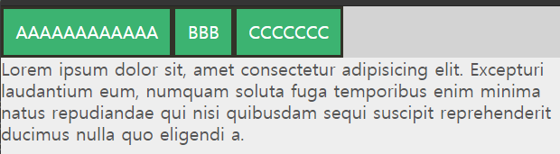

#### inline-flex
컨테이너에 `inline-flex`속성을 적용한다.  

```css
display: inline-flex;
```

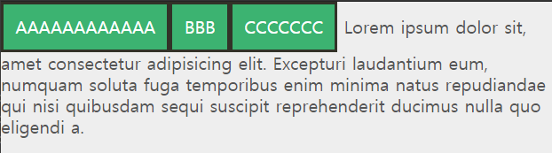

<br/>

### Flex-Direction
아이템들의 배치방향을 설정하는 속성이다.  

#### row
아이템들이 좌측에서 우측 가로 방향으로 배치되며 기본값이다.  

```css
flex-direction: row;
```

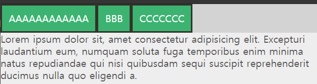

#### row-reverse
아이템들이 우측에서 좌측 가로 방향으로 배치된다.  

```css
flex-direction: row-reverse;
```

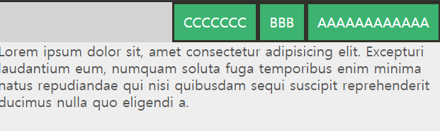

#### column
아이템들이 위쪽에서 아래쪽 방향으로 배치된다.  

```css
flex-direction: column;
```

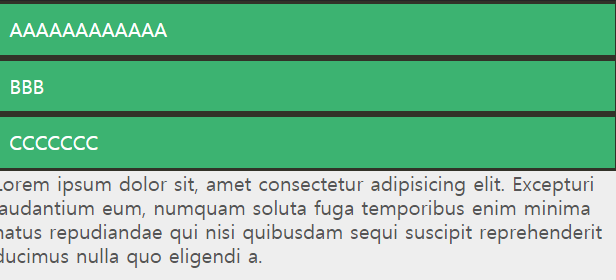

#### column-reverse
아이템들이 아래쪽에서 위쪽 방향으로 배치된다.  

```css
flex-direction: column-reverse;
```

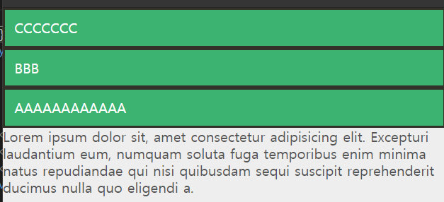

<br/>

### Flex-Wrap
아이템들의 줄바꿈을 결정하는 속성이다.  

#### nowrap
아이템들이 줄바꿈을 하지 않으며 기본값이다.  

```css
flex-wrap: nowrap;
```

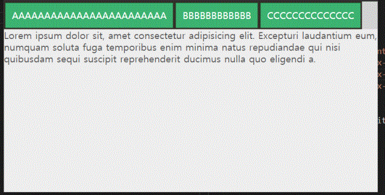

#### wrap
아이템들이 위쪽에서 아래쪽 방향으로 줄바꿈을 하게된다.  

```css
flex-wrap: wrap;
```

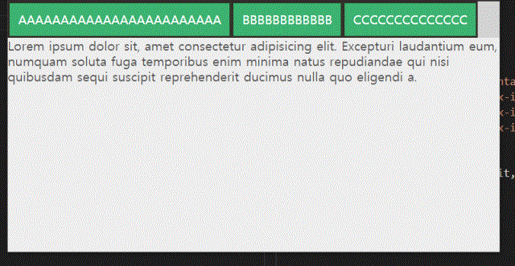

#### wrap-reverse
아이템들이 아래쪽에서 위쪽방향으로 줄바꿈을 하게된다.  

```css
flex-wrap: wrap-reverse;
```

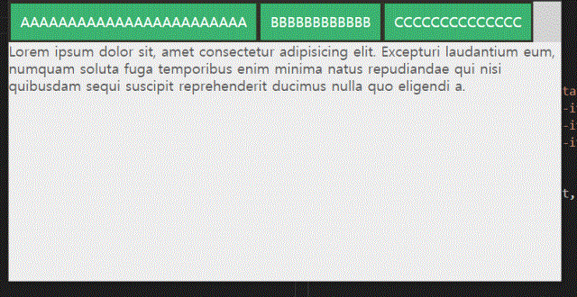

<br/>

### Justify-Content
메인축의 방향을 결정하는 속성이다.  

#### flex-start
아이템들이 메인축의 시작점으로 정렬하며, 기본값이다.  
`flex-direction`이 `row`일때는 왼쪽, `column`일때는 위쪽이다.   

```css
justify-content: flex-start;
```

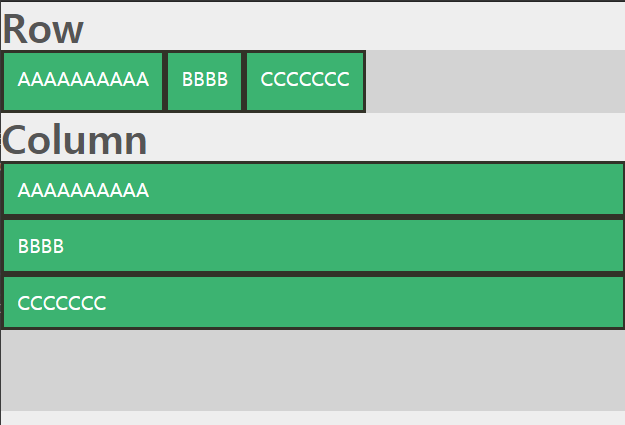

#### flex-end
아이템들이 메인축의 끝점으로 정렬한다.  
`flex-direction`이 `row`일때는 오른쪽, `column`일때는 아래쪽이다.   

```css
justify-content: flex-end;
```

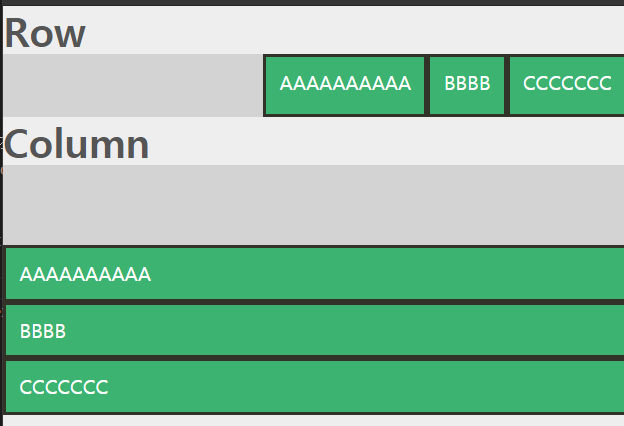

#### center
아이템들이 메인축의 가운데로 정렬한다.  

```css
justify-content: center;
```

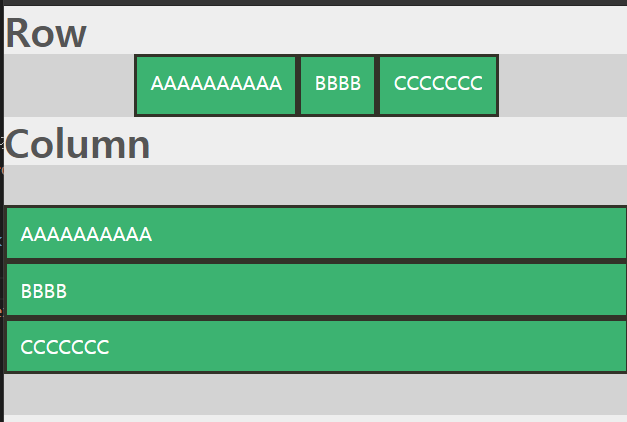

#### space-between
아이템들의 사이에 균일한 간격을 만든다.  

```css
justify-content: space-between;
```

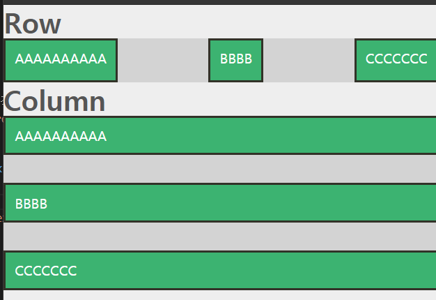

#### space-around
아이템들의 주위에 균일한 간격을 만든다.  

```css
justify-content: space-around;
```

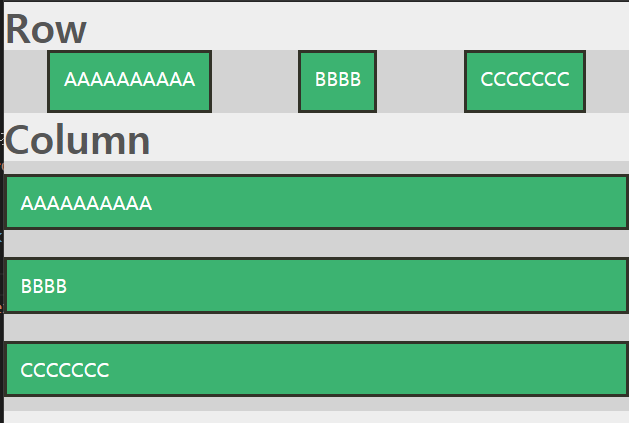

#### space-evenly
아이템들의 사이와 양끝에 균일한 간격을 만든다.  

```css
justify-content: space-evenly;
```

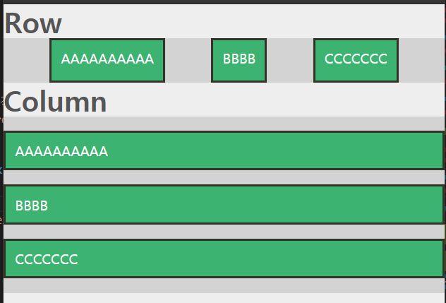

<br/>

### Align-Items
수직축 방향으로 아이템들을 정렬하는 속성이다.  

#### stretch
아이템들이 수직축방향으로 끝까지 늘어나며 기본값이다.  

```css
align-items: stretch;
```

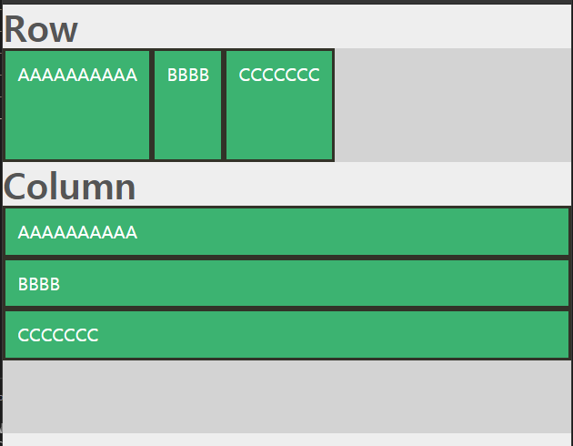

#### flex-start
아이템들이 메인축의 시작점으로 정렬하며, 기본값이다.  
`flex-direction`이 `row`일때는 왼쪽, `column`일때는 위쪽이다.  

```css
align-items: flex-start;
```

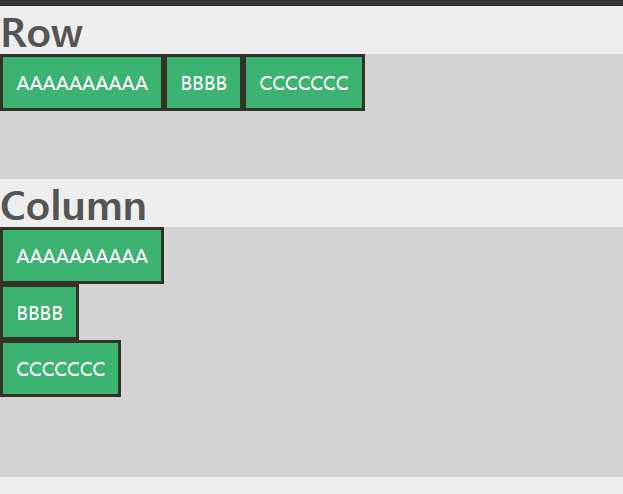

#### flex-end
아이템들이 메인축의 끝점으로 정렬한다.  
`flex-direction`이 `row`일때는 오른쪽, `column`일때는 아래쪽이다.  

```css
align-items: flex-end;
```

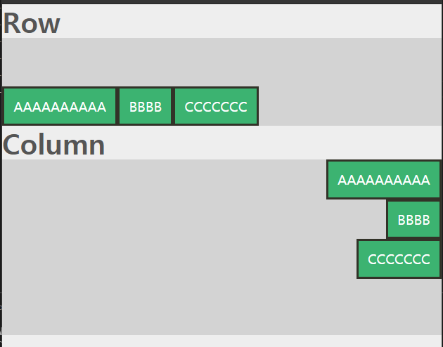

#### center
아이템들을 중앙으로 정렬한다.  

```css
align-items: center;
```

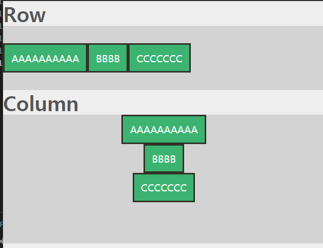

#### baseline
아이템들을 텍스트 베이스라인 기준으로 정렬한다.  

```css
align-items: baseline;
```

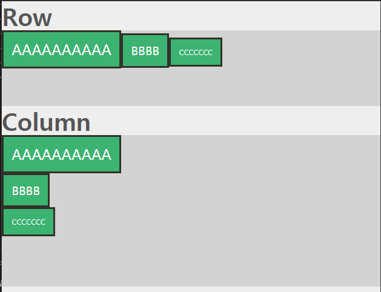

<br/>

### Align-Content
`flex-wrap: wrap`이 설정된 상태에서 아이템들의 줄바꿈이 일어났을때  
수직축 방향 정렬을 결정하는 속성으로 `justify-content`와 비슷한 방식으로 작동한다.  

<br/>


## Flex 아이템 속성

### Flex-Basis
아이템들의 기본 크기를 설정한다.  
`flex-direction`이 `row`일때는 너비, `column`일때는 높이로  
기본값은 `auto`이다.

```css
flex-basis: auto; /* 10, 10px, 10rem, 10%, ... */
```